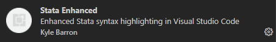

# Running Stata in VScode
### Disclaimer
This guide is heavily based on a guide I found online on how to run Stata on Visual Studio Code.  
As I was not able to find it again I decided to rewrite here all the passages so that this could be useful for anyone who needed such a guide.  
If the original author finds this guide, please contact me! I will be more than happy to include the relevant references to your blog post.

Note that this guide assumes the user has Stata already installed on his/her machine.

## Why running Stata in Visual Studio Code
Economists and statisticians often tend to use softwares (such as Stata or Matlab) as they are, without questioning the environment in which they code.  
However we can learn a lot from professional programmers, who use more advanced tools and better overall environments to write code.

Below are a few are the reasons why I am currently using VS Code to write do files and why I am not planning to go back to Stata's own do file editor anytime soon:
1. Text and command autocomplete
2. Better syntax highlight
3. Single environment for all my codes (Stata, python, R and even LaTex)
4. Seamless integration with Git
5. Snippets

## How to Install and run Stata from VSCode seamlessly

### Install VS code
Look for the latest VS Code version available here: https://code.visualstudio.com  
Click on *Download* and install VS Code

### Install Plug-Ins
To install extensions in VS Code click on the icon indicated below.


Two plugins are necessary to run Stata in VS Code:
1. **Stata Enhanced**  
Allows VS Code to recognize files *.do* and assigns them a familiar syntax highlighting


2. **Code Runner**
Allows VS Code to run custom commands with a shortcut


### Download and edit custom scripts
#### Download Scripts
Two custom scripts are needed to run Stata from another code editor.
Download the scripts here: https://huebler.blogspot.com/2008/04/stata.html.

If you are using Stata 15 or later, then *rundo51.zip* and *rundolines51.zip* should work. Otherwise if you are using an earlier version, download *Rundo41.zip* and *Rundolines41.zip*.

Extract both in a convenient location. The scripts don't need to be in any specific path, they just need to be accessible all the time by Stata and VS Code.

#### Edit Scripts
In both *rundo* and *rundolines* zipped folders you will find a config file:


Open the config file and edit the following lines:  
- *statapath = "[Path to your stata Executable]"*]  
Example: * statapath = "C:\Program Files (x86)\Stata15\StataSE-64.exe"*
- *statawin = "[Stata Version]"*  
Example: *statawin = "Stata/SE 15.0"*

Then save the config files and close them.

### Edit VS Code settings
To open the VS Code settings use: *CTRL + SHIFT + P*.
In the dialog window that opens, look for *Preferences: Open Settings (JSON)*

A new window should open with a json file (a text file between two curly brackets).

Paste the following line of code **between the two curly brackets**:
```json
"code-runner.executorMapByFileExtension": {
    ".do": "[Path to rundo.exe]"
},
"code-runner.customCommand": "[Path to rundolines.exe]",
"stataRun.stataPath": "[Path to Stata.exe]",
"stataRun.whichApp": "stataMP",
"stataRun.pasteSpeed": 1,
"stataRun.advancePosition": false,
```
Make sure to modify the three paths (rundo, rundolines and Stata) with the paths to the relevant .exe files.  
Note that the path don't work if there are any spaces and require the use of double slashes to be readable.

Here you can find an example for the path where I have saved rundo.exe:
```json
"code-runner.executorMapByFileExtension": {
    ".do": "C:\\PROGRA~2\\Stata13\\ado\\personal\\rundo41\\rundo.exe"
},
```

### Add Shortcuts to VS Code to run Stata
In Stata's do file editor we are used to using the *CTRL + D* shortcut a lot.  
Fortunately there is an (almost) identical solution here in VS Code.  

As for the previous step, we need to open the command bar in VS Code by clicking *CTRL + SHIFT + P*.  
Then we need to look for *Preferences: Open Keyboard Shortcuts*.
Then we can look for "Run Custom Command". This is the command that runs the highlighted lines in a do file. We can bind this to the shortcut *CTRL + D*.  
Then we can look for "Run Code". This is the command that runs the whole dofile. We can bind this to *CTRL + SHIFT + D*.

Now, whenever we open a do file with VS Code and we run either a few lines (CTRL + D) or the whole script (CTRL + SHIFT + D), VS Code will run those in a previously opened stata console.

If stata is not opened when using either command, then VS Code will simply open a new instance of Stata.

Unfortunately I am currently not aware of any way of using multiple stata consoles from VS Code.


